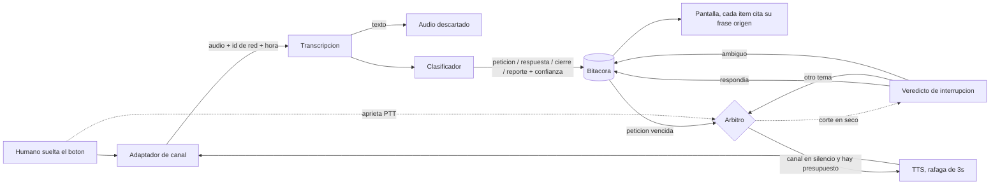

# Relevo

**La radio push-to-talk es el único canal de trabajo que todavía no tiene memoria.**

En obra, seguridad, logística y eventos todo lo importante se dice en voz alta y se evapora
al soltar el botón. Las peticiones se caen en el silencio sin que nadie sepa qué quedó
pendiente, y ocho horas de operación se transfieren de memoria en una entrega de turno de
dos minutos.

Relevo mete un agente **como un participante más dentro del canal**. Escucha todas las
transmisiones, sostiene el estado que ningún humano alcanza a tener completo, y transmite
con voz solo en dos momentos: cuando una petición lleva demasiado tiempo sin respuesta, y
cuando cambia el turno.

Nadie tiene que escribir, abrir una app ni cambiar cómo trabaja. La información ya se está
diciendo; el problema es que ningún humano la está escuchando completa.

---

## Lo que lo hace distinto de un chatbot con voz

Tres decisiones de diseño, y las tres son restricciones antes que features.

### 1 · El canal es de los humanos

En una radio PTT solo puede hablar uno a la vez. Un agente que transmite un resumen de 60
segundos **bloquea el canal 60 segundos para todos**, incluido quien necesite pedir auxilio.
Por eso:

- ráfagas de **máximo 3 segundos**
- nunca empieza a hablar si alguien tiene el PTT apretado
- si un humano aprieta mientras el agente habla, **el TTS se corta a mitad de palabra**
- techo de **2 transmisiones por hora de canal**

El silencio es el estado por defecto. Un agente que habla más no está trabajando más.

### 2 · Si lo interrumpen, averigua si le respondieron

Cuando alguien corta al agente, Relevo clasifica esa transmisión entrante para saber si
**responde el pendiente que estaba anunciando**:

| La interrupción | Qué hace Relevo |
|---|---|
| Respondía el pendiente | Lo cierra y **no repite nunca** |
| Era de otro tema | Reintenta el mensaje completo en el siguiente silencio, **una sola vez** |
| No se pudo determinar | **No reintenta.** Marca el ítem para revisión humana |

### 3 · Sin huella vocal. Nunca

La identidad del hablante **no se deduce analizando la voz**: se toma del id de remitente
que la red PTT ya entrega en cada transmisión. En PTT la diarización es gratis y no
biométrica, porque el botón ya firmó y segmentó el audio.

Consecuencia: no hay dato biométrico en ninguna parte del sistema. El audio original se
descarta en cuanto se transcribe, y solo sobrevive el texto.

**Prohibido por diseño:** extraer o comparar embeddings de voz · retener audio después de
transcribir · usar el sistema como insumo de evaluación de desempeño individual.

---

## Arquitectura



El **adaptador de canal** es intercambiable: `pwa` (PTT propio en navegador) o `zello`
(red real). El núcleo no sabe en cuál está corriendo.

| Archivo | Qué hace |
|---|---|
| `src/core/arbiter.js` | Disciplina de canal, corte, veredicto de interrupción, reintento |
| `src/core/state.js` | La bitácora. Nunca entra audio, nunca entra biometría |
| `src/core/ai.js` | Transcripción, clasificación, veredicto, TTS |
| `src/adapters/pwa.js` | Canal propio: servidor WebSocket + PTT en navegador |
| `src/adapters/zello.js` | Zello Channel API. **No verificado**, ver el encabezado del archivo |

---

## Correr

```bash
npm install
cp .env.example .env   # y pon tu OPENAI_API_KEY
npm run dev
```

Abre dos pestañas o dos teléfonos en la misma red:

- **Radio:** `http://localhost:8787/?user=torre3` y `?user=central`
- **Bitácora:** `http://localhost:8787/?board=1`

Mantén apretado el círculo para transmitir.

### Probar sin micrófono

La pantalla de bitácora trae un campo de inyección de texto. Sirve para probar el árbitro y
la máquina de estados sin grabar nada:

- **Enviar** — entra como una transmisión normal
- **Enviar interrumpiendo** — simula que alguien aprieta PTT mientras el agente habla, que
  es la única forma de probar el veredicto de interrupción sin dos personas y un micrófono

Secuencia mínima para ver el ciclo completo:

1. `necesito material en el piso 8, me copian` → se abre una petición
2. esperas el umbral (20 s por defecto) → el agente transmite el aviso
3. mientras habla, **Enviar interrumpiendo** con `ya va subiendo el material al 8` → cierra
   el ítem y no repite
4. repite el paso 1 y en el 3 interrumpe con `cuidado en la torre 2` → reintenta una vez

### Comandos de voz

| Decir al canal | Qué pasa |
|---|---|
| *"Relevo, relevo de turno"* | Transmite los 3 pendientes más importantes, el resto queda en bitácora |
| *"Relevo, cerrado"* | Cierra el pendiente más antiguo |
| *"Relevo, silencio"* | **Lo apaga.** Corta lo que esté sonando y no vuelve a tomar el canal |
| *"Relevo, activo"* | Lo reactiva |

### El kill switch

Cualquiera en el canal puede apagar a Relevo hablando. No hay que abrir nada, no hay que
pedirle permiso a nadie y no hay una configuración escondida: se dice al aire y el agente se
calla, incluso a mitad de palabra.

Silenciado **sigue escuchando y sigue sosteniendo la bitácora**, pero no transmite nunca. Los
avisos que caían en ese rato se pierden a propósito: acumularlos y dispararlos todos al
reactivar sería exactamente el flood que el presupuesto de interrupción existe para evitar.
Los pendientes no se pierden, solo el aviso — quedan abiertos en la bitácora.

Ese mismo estado es el **modo sordo** que el plan de evaluación necesita como brazo de
control: escucha y registra sin intervenir, y es la única forma de medir cuántas peticiones se
habrían caído sin el agente.

El detector del kill switch corre **antes** que cualquier clasificación, porque apagar al
agente no puede depender de que el agente entienda bien.

---

## Configuración

Todo en `.env`. Los que importan:

| Variable | Default | Para qué |
|---|---|---|
| `UNANSWERED_MS` | `20000` | Umbral de petición sin respuesta. 60000 en operación real; 20000 para no esperar un minuto en cámara |
| `MAX_BURST_MS` | `3000` | Tope duro de duración de una transmisión del agente |
| `MAX_TX_PER_HOUR` | `2` | Presupuesto de interrupción |
| `MAX_RETRIES` | `1` | Reintentos por ítem tras una interrupción ajena |
| `MIN_CONFIDENCE` | `0.6` | Debajo de esto no se transmite nada y el ítem va a revisión humana |

---

## Estado y honestidad sobre el alcance

Construido en el hackathon AI Tinkerers "Agents, Everywhere", 12 de septiembre de 2026.

**Funciona:** el canal propio de PTT, el ciclo completo de transcripción → clasificación →
bitácora, el aviso de petición sin respuesta, la disciplina de canal con corte en seco, el
veredicto de interrupción con reintento único, y el relevo de turno por voz.

**El adaptador de Zello, con precisión.** Lo que está verificado y lo que no:

| Pieza | Estado |
|---|---|
| Codec Opus en las dos direcciones | **Verificado.** Ida y vuelta de PCM a Opus a WAV sin pérdida de paquetes |
| Formato del paquete binario | **Verificado** contra la especificación: `type(8)=0x01, stream_id(32BE), packet_id(32BE)` |
| `codec_header` | **Verificado.** `sample_rate(16LE), frames_per_packet(8), frame_size_ms(8)` |
| Conexión y `logon` | **Verificado:** el servidor respondió al protocolo |
| Audio fluyendo por un canal real | **NO verificado** |

Lo último no se pudo probar por la red del sitio, no por el código: en la red con internet
`zellowork.io` está bloqueado, y en la red donde no lo está no había internet. Las credenciales
de Zello Work no se pudieron ejercitar.

Detalle que vale la pena: en este adaptador el corte a mitad de palabra es **literal**. Los
paquetes se pulsan al ritmo real del audio, uno cada 60 ms, así que abortar es dejar de enviar
y los paquetes que no salieron no existen. No es pausar un audio que ya viajó.

**Fuera de alcance a propósito**, y por qué:

| Excluido | Razón |
|---|---|
| Redes LMR / DMR con vocoder AMBE+2 | Sobre banda estrecha el error de transcripción se va a 55-69%. Entra después vía gateway RoIP, no hoy |
| Diarización con PyAnnote | Innecesaria: la red PTT ya firma cada transmisión |
| Supresión de ruido | Sobre IP de banda ancha no paga su costo de integración todavía |
| Streaming / Realtime | El botón PTT ya da los límites de turno. Agrega riesgo sin agregar función |
| Biometría de voz | Prohibida por principio, no pendiente por tiempo |

El expediente de producto completo (Product Vision Board, PRD, medición de afirmaciones y
decisiones de diseño) está en [`producto/`](../producto).
